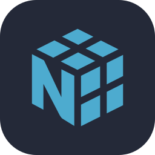
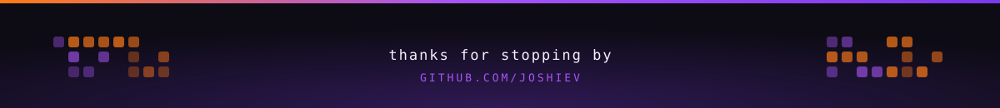

<div align="center">




<br/>

<a href="https://github.com/joshieV"></a>
<a href="https://www.linkedin.com/in/joshuawillis06/"></a>
<a href="https://leetcode.com/u/joshiepz/"></a>
<a href="mailto:joshievaccaro@gmail.com"></a>


</div>


## 👋&nbsp; About me

```java
public class Joshua {
    String   education = "Incoming BSc Software Engineering @ University of Leicester";
    String   completed = "Level 3 Extended Diploma in Computer Science";
    String[] building  = {"Java", "Python", "React"};
    String[] learning  = {"TypeScript", "Spring Boot", "DSA", "Deployment"};
    String   goal      = "Future FAANG SWE";
    boolean  openTo    = true; // internships, collabs, open source
}
```

I'm a software engineering student from the UK who likes building things that actually run. Right now I'm splitting my time between **front-end apps**, **backend fundamentals**, and **algorithm practice**, turning coursework theory into projects I can point at.

<table>
<tr>
<td width="50%" valign="top">

**🎯&nbsp; Currently**

- Starting my BSc at Leicester
- Solving NeetCode / LeetCode daily
- Building small portfolio projects

</td>
<td width="50%" valign="top">

**🌱&nbsp; Next up**

- TypeScript + Spring Boot
- Data structures & algorithms
- Deployment best practices

</td>
</tr>
</table>


## 🛠️&nbsp; Tech stack

<div align="center">

**Languages**


**Front-end &amp; UI**


**Back-end &amp; data**




**Tools**


**Want to learn**


</div>


## 📌&nbsp; Featured projects

<div align="center">

| Project | What it is | Built with |
| :--- | :--- | :--- |
| **[discord-clone](https://github.com/joshieV/discord-clone)** | A Discord-style chat app, my biggest build so far | `Java` |
| **[neetcode-submissions](https://github.com/joshieV/neetcode-submissions)** | Every NeetCode.io problem I've solved, kept public | `Java` |
| **[Stopwatch_and_Clock_App](https://github.com/joshieV/Stopwatch_and_Clock_App)** | Desktop stopwatch &amp; clock with a clean UI | `Python` |
| **[helloworld-calculator](https://github.com/joshieV/helloworld-calculator)** | The world's most useless calculator, built for pure fun | `JavaScript` |

</div>


## 📊&nbsp; GitHub stats

<div align="center">

<picture>
  <source media="(prefers-color-scheme: dark)" srcset="https://github-profile-summary-cards.vercel.app/api/cards/profile-details?username=joshieV&theme=github_dark" />
  
</picture>

<picture>
  <source media="(prefers-color-scheme: dark)" srcset="https://github-profile-summary-cards.vercel.app/api/cards/repos-per-language?username=joshieV&theme=github_dark" />
  
</picture>
<picture>
  <source media="(prefers-color-scheme: dark)" srcset="https://github-profile-summary-cards.vercel.app/api/cards/most-commit-language?username=joshieV&theme=github_dark" />
  
</picture>

<br/><br/>

<picture>
  <source media="(prefers-color-scheme: dark)" srcset="https://github-readme-activity-graph.vercel.app/graph?username=joshieV&bg_color=0D1117&color=C9D1D9&line=A855F7&point=FF7A18&area=true&area_color=7C3AED&hide_border=true&custom_title=Contribution%20activity" />
  
</picture>

</div>


## 🤝&nbsp; Let's connect

<div align="center">

I'm **open to internships, beginner-friendly collaborations, and open-source contributions.**<br/>
If you're building something interesting, my inbox is open.

<br/>

<a href="https://www.linkedin.com/in/joshuawillis06/"></a>
<a href="https://leetcode.com/u/joshiepz/"></a>
<a href="mailto:joshievaccaro@gmail.com"></a>

<br/><br/>

</div>


